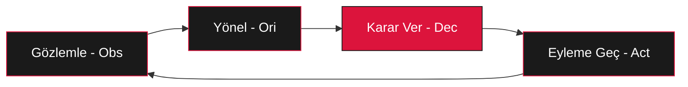

# Sun-Tzu Mastery: Stratejik İşletim Sistemi (S.O.S) 🐉


[](https://github.com/arch-yunus/Sun-Tzu-Mastery)
[](README.md)
[](core/README.md)

> *"Savaşı kazanan general, savaştan önce karargahında pek çok hesaplama yapandır."* — **Sun Tzu**

**Sun-Tzu Mastery**, Sun Tzu'nun *Savaş Sanatı* (Sunzi Bingfa) eseri üzerine kurgulanmış seçkin, yüksek yoğunluklu bir araştırma arşivi ve stratejik çerçevedir. Bu proje, basit bir metin arşivinin ötesine geçerek; kadim bilgeliği modern sistem mühendisliği, liderlik ve kriz yönetimi için bir **Stratejik İşletim Sistemi**'ne dönüştürür.

---

## 🚀 Hızlı Başlangıç (Quick Start)

Sistemi hemen kullanmaya başlamak için şu 3 adımı izleyin:

1.  **Hesaplama Yap:** `frameworks/` dizinindeki araçları kullanarak mevcut durumunu analiz et.
2.  **Doktrini İncele:** `doctrines/` altındaki 13 ana bölümden mevcut krizine veya hedefine uygun olanı seç.
3.  **Uygula:** `frameworks/` içindeki playbook'lar (SRE, Growth Hacking) ile teoriyi pratiğe dök.

```powershell
# Stratejik Üstünlüğünü Test Et
python frameworks/StrategicCalculation.py --tao 9 --commander 8 --heaven_earth 7 --discipline 9 --logistics 8 --training 9
```

---

## 🏛 Vizyon ve Kapsam

Bu depo, Sun Tzu'nun döktrinlerini orijinal bağlamından çıkarıp 21. yüzyılın ihtiyaçlarına göre yeniden mimari etmeyi amaçlar. Stratejik prensipler; **Sibernetik, Oyun Teorisi ve Meta-Mühendislik** merceğinden analiz edilerek, askeri terminolojiden saf mantık ve adaptif sistemler alanına taşınmıştır.

---

## 🛠 Stratejik Ekosistem ve Araçlar

### 🏮 Stratejik Sözlük (Modern Karşılıklar)

| Kavram | Geleneksel Tanım | **Modern Mühendislik Karşılığı** |
| :--- | :--- | :--- |
| **Tao** | Ahlaki Yasa / Yol | Vizyon Hizalanması, Kültür ve Amaç Birliği |
| **Qi** | Dolaylı / Sürpriz Güç | İnovasyon, "Edge" Özellikler, Asimetrik Rekabet |
| **Shi** | Momentum / Enerji | Dağıtım Hızı (Velocity), Pazar İvmesi |
| **Xu** | Boşluk / Zayıflık | Pazar Gaps, Teknik Borç, Rakip Hataları |

### 📊 Karar Akış Modeli (OODA Entegrasyonu)



---

## 📜 On Üç Doktrin (SOPs)

Depo, her biri yüksek yoğunluklu teknik analizlerle eşleştirilmiş 13 orijinal bölümetrafında yapılandırılmıştır:

| # | Bölüm | Odak Noktası | Teknik Alan |
| :--- | :--- | :--- | :--- |
| **01** | [Detaylı Değerlendirme](doctrines/01_planning) | Tao, Gök, Yer, Komutan | Sistem Spesifikasyonları |
| **02** | [Savaşın Maliyeti](doctrines/02_operations) | Kaynak Yönetimi | Cloud OpEx & FinOps |
| **03** | [Stratejik Saldırı](doctrines/03_strategic_attack) | Bütünlük ve Birlik | Zero-Downtime Migration |
| **04** | [Taktiksel Düzen](doctrines/04_tactical_dispositions) | Yenilmezlik | Cyber Defense & SRE |
| **05** | [Enerji (Shi)](doctrines/05_energy) | Momentum | DevOps Velocity |
| **06** | [Zayıf ve Güçlü](doctrines/06_weak_points_and_strong) | Boşluklar ve Doluluk | Market Gaps & OSINT |
| **07** | [Manevra](doctrines/07_maneuvering) | Sapmaları Doğruya Çevirmek | Pivot & Iterative Dev |
| **08** | [Çeşitlilik](doctrines/08_variation_in_tactics) | Beş Tuzak | Edge Case Management |
| **09** | [Yürüyüş](doctrines/09_the_army_on_the_march) | Çevresel Gözlem | Observability & Metrics |
| **10** | [Arazi](doctrines/10_terrain) | Konumlandırma | Market Segmentation |
| **11** | [Dokuz Durum](doctrines/11_the_nine_situations) | Psikolojik Arazi | Incident Response |
| **12** | [Ateşle Saldırı](doctrines/12_the_attack_by_fire) | Altyapı İmhası | Chaos Engineering |
| **13** | [Casuslar](doctrines/13_the_use_of_spies) | Bilgi Asimetrisi | Competitive Intelligence |

---

## 🛠 İleri Seviye Araç Rehberi

### Stratejik Hesaplama Örneği
`StrategicCalculation.py` aracını çalıştırdığınızda, sistem size şu durumlardan birini döndürür:

- **STATUS: Tam Hakimiyet** -> Pazar şartları ve ekip vizyonu mükemmel seviyede. Saldırıya geçin.
- **STATUS: Üstünlük** -> Avantajlısınız ancak riskler mevcut. Manevralara devam edin.
- **STATUS: Denge** -> Doğrudan çatışmadan kaçının. Dolaylı (Qi) inovasyonlara odaklanın.
- **STATUS: Kritik Zayıflık** -> Sistemsel çökmeyi önlemek için savunmaya çekilin.

---

## 📂 Depo Haritası (Repository Architecture)

```text
.
├── .github/                # Stratejik yönetişim ve otomasyonlar
├── core/                   # Felsefi ve Teorik Temeller (Sibernetik, Oyun Teorisi)
├── doctrines/              # 13 Ana Doktrin ve Teknik Uygulama Dosyaları
├── docs/                   # Görsel varlıklar ve araştırma dökümanları
├── frameworks/             # Hesaplamalı araçlar, SRE ve Growth Playbook'ları
├── CONTRIBUTING.md         # Seçkin geliştiriciler için katılım protokolü
└── README.md               # S.O.S Ana Giriş Portalı
```

---

## 🛰 Gelecek Vizyonu (Roadmap)

- **Faz 3:** AI tabanlı stratejik analiz botu entegrasyonu.
- **Faz 4:** Gerçek zamanlı pazar telemetrisi üzerinden dinamik doktrin güncellemeleri.
- **Faz 5:** VR destekli stratejik simülasyon odası dökümantasyonu.

---

<div align="center">
  <sub>Meta-Engineering Research Lab tarafından 🏮 ile inşa edilmiştir.</sub>
  <br>
  <sup>"Gerçek usta, rakibinin hamlesini o daha düşünmeden bitirendir."</sup>
</div>