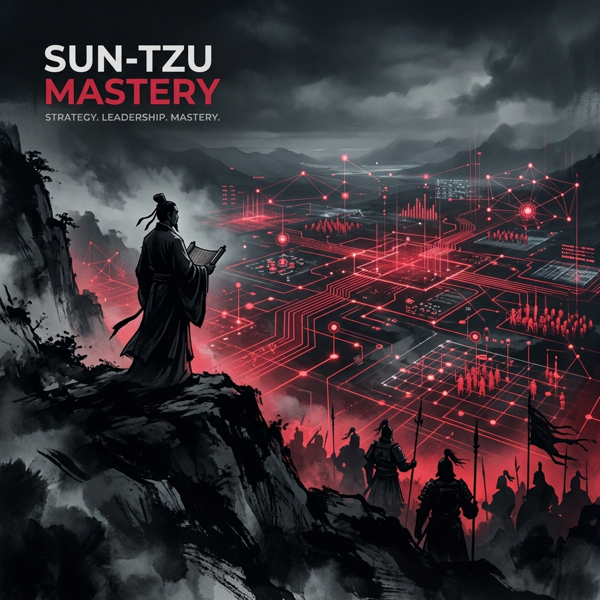

# Sun-Tzu Mastery: Kişisel Gelişim ve Stratejik Bilgelik 🏮

> *"Kendini ve başkasını tanıyan kişi, yüz savaşta da tehlikeye düşmez."* — **Sun Tzu**

**Sun-Tzu Mastery**, Sun Tzu'nun kadim eseri *Savaş Sanatı*'nı (Sunzi Bingfa) bir **Kişisel Gelişim Rehberi ve Karakter İnşası** doktrini olarak ele alan derinlemesine bir analiz arşivi ve öğrenme platformudur. Bu projenin asıl amacı; eseri sadece askeri bir metin olarak değil, insanın kendi zihniyle, egosuyla ve hayatın zorluklarıyla başa çıkma sanatı olarak incelemektir.

---

## 🏛 Vizyon ve Amacı

Bu depo, Sun Tzu'nun felsefesini şu dört ana hedef doğrultusunda irdeler:
1.  **Öğrenmek ve Öğretmek:** Eserin her cümlesini felsefi ve edebi açıdan analiz ederek kalıcı bir bilgi mirası oluşturmak.
2.  **Kişisel Gelişim:** Stratejik disiplini bireysel hayata, etik değerlere ve öz-disipline (Self-Mastery) entegre etmek.
3.  **Karakter İnşası:** Stoacılık, Taoizm ve Savaş Sanatı ilkelerini birleştirerek sağlam bir "Lider Karakteri" geliştirmek.
4.  **Çatışma Çözümü:** Günlük hayattaki zorlukları "savaşmadan kazanma" estetiğiyle çözebilme becerisi kazanmak.

---

## 🧘 Felsefi Sütunlar (Kişisel Mastery)

1.  **İçsel Tao (Öz-Hizalanma):** 💧
    *   Doğal akışla uyum içinde olmak. En büyük savaş, kişinin kendi içindeki kaosla olan savaşıdır.
2.  **Zihinsel Berraklık (Gök ve Yer):** 🧠
    *   Koşulları objektif değerlendirmek. Duyguların esiri olmadan, sadece gerçeği görerek hareket etmek.
3.  **Ego Yönetimi (Formsuzluk):** 🛡️
    *   Esneklik ve tevazu. Bir kap içindeki su gibi, kibirden arınmış ve her duruma uyum sağlayan bir zihin yapısı.

---

## 📜 13 Doktrin: Kişisel Gelişim Modülleri

Eserin 13 bölümünü, bireysel gelişim merceğinden derinlemesine inceliyoruz:

| # | Bölüm | Kişisel Gelişim Odağı | Amaç |
| :--- | :--- | :--- | :--- |
| **01** | [Planlama](doctrines/01_planning) | **Öz-Farkındalık** | Kendi kapasiteni ve sınırlarını dürüstçe ölçmek. |
| **02** | [Operasyon](doctrines/02_operations) | **Enerji Yönetimi** | Zamanı ve enerjiyi tükenmeden en verimli şekilde kullanmak. |
| **03** | [Saldırı](doctrines/03_strategic_attack) | **Zararsızlık** | Sorunları kimseyi kırmadan, bütünlüğü bozmadan çözebilmek. |
| **04** | [Düzen](doctrines/04_tactical_dispositions) | **İçsel Dayanıklılık** | Yenilmez bir karakter ve sarsılmaz bir ruh hali inşa etmek. |
| **05** | [Enerji](doctrines/05_energy) | **Motivasyon veShi** | Potansiyel gücü doğru zamanda disiplinli eyleme dönüştürmek. |
| **06** | [Zayıf/Güçlü](doctrines/06_weak_points_and_strong) | **Odaklanma** | Zayıf yönleri geliştirmek, güçlü yönleri keskinleştirmek. |
| **07** | [Manevra](doctrines/07_maneuvering) | **Adaptasyon** | Hayatın beklenmedik değişimlerine karşı esnek kalabilmek. |
| **08** | [Varyasyon](doctrines/08_variation_in_tactics) | **Zihinsel Esneklik** | Dogmalardan kurtulup her duruma özel çözümler üretmek. |
| **09** | [Yürüyüş](doctrines/09_the_army_on_the_march) | **Gözlem Yeteneği** | Çevreyi ve insan psikolojisini doğru okuma sanatı. |
| **10** | [Arazi](doctrines/10_terrain) | **Sınır Belirleme** | Kendi etki alanını ve sosyal sınırlarını doğru yönetmek. |
| **11** | [Durumlar](doctrines/11_the_nine_situations) | **Kriz Yönetimi** | Zor anlarda paniklemeden, en doğru kararı verebilmek. |
| **12** | [Ateş](doctrines/12_the_attack_by_fire) | **Radikal Değişim** | Kötü alışkanlıkları ve yıkıcı düşünceleri kökten yok etmek. |
| **13** | [Casuslar](doctrines/13_the_use_of_spies) | **Bilgelik ve Bilgi** | Derin bilgi (insight) sahibi olmak ve öngörü geliştirmek. |

---

## 📂 Depo Yapısı

- `core/`: Felsefi temeller, Taoizm, Stoacılık ve Karakter İnşası araştırmaları.
- `doctrines/`: 13 bölümün kişisel gelişim odaklı derinlemesine incelemeleri.
- `docs/`: Öğretici notlar, alıntılar ve grafiksel anlatımlar.
- `strategic_os/`: (Yan Dizin) Stratejinin teknik ve mühendislik sistemlerine uygulanmış hali (Opsiyonel).

---

## 🛡️ Etik Beyan ve Misyon

Bu arşiv, bireyin kendini keşfetme ve geliştirme yolculuğuna ışık tutmak için oluşturulmuştur. Savaş terimleri birer metafor olup, gerçek mücadele **kişinin kendi gölgesiyledir.**

---

  Öğrenmek ve Öğretmek için 🏮 ile inşa edilmiştir.
   
  "En büyük zafer, kişinin kendi üzerindeki zaferidir."

