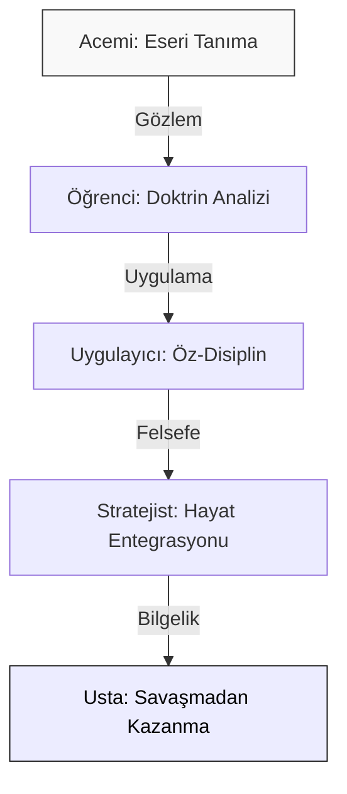

# Sun-Tzu Mastery: Kişisel Gelişim ve Stratejik Bilgelik 🏮

**"En büyük zafer, kişinin kendi üzerindeki zaferidir."**

---

## 🏛 Vizyon: Karakter, Disiplin ve Bilgelik

**Sun-Tzu Mastery**, Sun Tzu'un kadim eseri *Savaş Sanatı*'nı biyolojik ve sosyal bir varlık olarak insanın kendi varoluşsal mücadelesi için bir **Kişisel Gelişim İşletim Sistemi** olarak ele alır. Bu depo, stratejiyi bir "başkalarını yenme" aracı olarak değil, bir **"kendine hakim olma"** (Self-Sovereignty) disiplini olarak analiz eder.

---

## 🚀 Stratejik Yaşam Metodolojisi (SYMet)

Doktrinleri hayatınıza entegre etmek için şu 5 aşamalı metodolojiyi izleyin:

1.  **İçsel Tahribatı Durdur (Doktrin II):** Enerjini tüketen gereksiz tartışmaları, kötü alışkanlıkları ve negatif düşünceleri "maliyet analizi" ile terk et.
2.  **Yenilmez Karakter İnşa Et (Doktrin IV):** Dış dünyaya saldırmadan önce, kendi etik ve disiplin duvarlarını ör.
3.  **Tevazu ve Esneklik Kazan (Doktrin VII):** Egonun sertliğini kır, su gibi esneklik kazanarak engellerin etrafından dolanmayı öğren.
4.  **Boşlukları Tespit Et (Doktrin VI):** Kendi zayıf yönlerini dürüstçe fark et ve enerjini sadece dönüştürebileceğin alanlara odakla.
5.  **Bütünlük İçinde Kazan (Doktrin III):** Sorunları kimseyi yıkmadan, aksine durumu iyileştirerek çöz.

---

## 🗺️ Ustalık Yol Haritası (Mastery Roadmap)

Stratejik bilgelik seviyenizi şu adımlarla yükseltin:

---

## 📜 On Üç Doktrin: Bireysel Gelişim Arşivi

| # | Doktrin | Kişisel Gelişim Karşılığı | Temel Kazanım |
| :--- | :--- | :--- | :--- |
| **01** | [Planlama](doctrines/01_planning) | **Öz-Farkındalık** | Kendini ve çevreni dürüstçe tartma. |
| **02** | [Operasyon](doctrines/02_operations) | **Enerji Yönetimi** | Zamanı ve iradeyi tasarruflu kullanma. |
| **03** | [Saldırı](doctrines/03_strategic_attack) | **Çatışma Çözümü** | Zarar vermeden sorun giderme sanatı. |
| **04** | [Düzen](doctrines/04_tactical_dispositions) | **Öz-Disiplin** | Sarsılmaz bir karakter kalesi kurma. |
| **05** | [Enerji](doctrines/05_energy) | **Motivasyon** | Potansiyel gücü doğru anda serbest bırakma. |
| **06** | [Zayıf/Güçlü](doctrines/06_weak_points_and_strong) | **Önceliklendirme** | Kritik eksiklere odaklanma yetisi. |
| **07** | [Manevra](doctrines/07_maneuvering) | **Zihinsel Çeviklik** | Değişime ve kadere uyum sağlama. |
| **08** | [Varyasyon](doctrines/08_variation_in_tactics) | **Duygusal Denge** | Duygusal tuzaklardan (öfke, korku) arınma. |
| **09** | [Yürüyüş](doctrines/09_the_army_on_the_march) | **Gözlem** | Çevredeki ince değişimleri fark etme. |
| **10** | [Arazi](doctrines/10_terrain) | **Sosyal Sınırlar** | Doğru ortam ve doğru insan seçimi. |
| **11** | [Durumlar](doctrines/11_the_nine_situations) | **Kriz Psikolojisi** | Zor anlarda paniklememe becerisi. |
| **12** | [Ateş](doctrines/12_the_attack_by_fire) | **Radikal Arınma** | Eski benliği feda edip yeniden doğma. |
| **13** | [Casuslar](doctrines/13_the_use_of_spies) | **Öngörü ve Bilgi** | Derin bilgi (insight) ile hareket etme. |

---

## 🏮 Karakter Heuristikleri (Sezgisel İlkeler)

Günlük yaşamda karar alırken bu "altın kuralları" referans alın:

- **Duyguların Esiri Olma:** Öfkeyle verilen kararlar, Doktrin VIII'deki en büyük "yönetici hatasıdır."
- **Sükunet Güçtür:** Sessizlik, derin bir hazırlığın maskesidir. Gürültü yapanlar genellikle içsel olarak boştur.
- **Kibiri Terk Et:** Doktrin VI'da belirtildiği gibi, ego bir "doluluktur" (Fullness). Bilgiye yer açmak için zihnini boşalt (Emptying).
- **Zamanın Ruhu:** Gök (Timing) senin elinde değildir, ancak ona uyum sağlamak senin yeteneğindir.

---

## 🧠 Zihinsel Modeller ve Sun Tzu Entegrasyonu

Sun Tzu'un düşünce yapısı, modern zihinsel modellerle tam uyum içindedir:
1.  **Inversion (Tersine Çevirme):** Kazanmak yerine, nasıl kaybedebileceğini analiz et (Doktrin IV). Kaybetme yollarını kapattığında, geriye sadece zafer kalır.
2.  **First Principles (Temel İlkeler):** Karmaşık durumlarda Doktrin I'deki "Beş Faktör"e dön. Tao, Gök, Yer, Lider ve Disiplin değişmez temel taşlardır.
3.  **Circle of Competence (Yetkinlik Çemberi):** Sadece anladığın ve hakim olduğun "arazilerde" eyleme geç (Doktrin X).

---

## 📂 Depo Yapısı

- **[core/](core/):** Felsefi derinlik, Karakter İnşası, Stoacılık ve Taoizm dökümanları.
- **[doctrines/](doctrines/):** 13 ana doktrin üzerine bireysel gelişim analizleri.
- **[docs/](docs/):** Öğretici notlar, grafikler ve alıntılar.
- **[strategic_os/](strategic_os/):** (Yan Dizin) Stratejinin teknik ve mühendislik sistemlerine uyarlandığı terminal araçları.

---

## 🕊️ Katkı ve Kolektif Bilgelik

Bu depo, "Öğrenmek ve Öğretmek" için yaşayan bir organizmadır. Bir doktrini hayatınızda nasıl uyguladığınızı, hangi engelleri aştığınızı veya esere dair yeni bir felsefi keşfinizi paylaşmak isterseniz; lütfen [CONTRIBUTING.md](CONTRIBUTING.md) protokolünü izleyerek katkıda bulunun.

---

  Meta-Engineering Research Lab tarafından 🏮 ile inşa edilmiştir.
   
  "Zayıf görün ama güçlü ol; görünmez ol ama her yerde ol."

