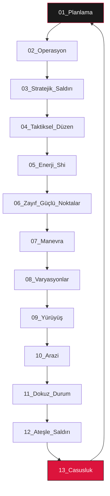

# Sun-Tzu Mastery: Stratejik İşletim Sistemi (S.O.S) 🐉


[](https://github.com/arch-yunus/Sun-Tzu-Mastery)
[](README.md)
[](core/README.md)
[](core/README.md)

> *"Savaşı kazanan general, savaştan önce karargahında pek çok hesaplama yapandır. Hesaplaması çok olan kazanır, az olan kaybeder. Hiç hesaplama yapmayan ne olur?"* — **Sun Tzu**

**Sun-Tzu Mastery**, Sun Tzu'sunun *Savaş Sanatı* (Sunzi Bingfa) eseri üzerine kurgulanmış seçkin, yüksek yoğunluklu bir araştırma arşivi ve stratejik çerçevedir. Bu sistem, kadim bilgeliği modern sistem mühendisliği, ürün yönetimi ve kriz yönetimi için bir **Stratejik İşletim Sistemi**'ne dönüştürür.

---

## 🚀 Hızlı Başlangıç (Quick Start)

Sistemi hemen kullanmaya başlamak için şu 3 adımı izleyin:

1.  **Hesaplama Yap:** `frameworks/` dizinindeki araçları kullanarak mevcut durumunu analiz et.
2.  **Doktrini İncele:** `doctrines/` altındaki 13 ana bölümden mevcut krizine veya hedefine uygun olanı seç.
3.  **Uygula:** `frameworks/` içindeki playbook'lar (SRE, Growth Hacking) ile teoriyi pratiğe dök.

```powershell
# Stratejik Üstünlüğünü Test Et
python frameworks/StrategicCalculation.py --tao 9 --commander 8 --heaven_earth 7 --discipline 9 --logistics 8 --training 9
```

---

## 🏛 Stratejik Mimari ve Doktrin Akışı

Sun-Tzu Mastery, bir projenin yaşam döngüsünü 13 evrelik bir doktrin akışı olarak görür. Aşağıdaki şema, stratejik durumların birbirini nasıl tetiklediğini gösterir:



---

## 🛠 Stratejik Sözlük ve Mühendislik Karşılıkları

| Kavram | Geleneksel Tanım | **Modern Mühendislik Karşılığı** | **CSF (Kritik Başarı Faktörü)** |
| :--- | :--- | :--- | :--- |
| **Tao** | Yol / AHLAKİ Yasa | Vizyon Hizalanması / Kültür | Ekip içi bağlılık skoru > %90 |
| **Qi** | Dolaylı / Sürpriz Güç | İnovasyon / Disruptive Tech | R&D yatırım oranı |
| **Shi** | Momentum / Enerji | Dağıtım Hızı (Velocity) | Haftalık Deployment sayısı |
| **Xu** | Boşluk / Zayıflık | Market Gaps / Teknik Borç | Rakip hata raporları / Bug bounty |
| **Jiang** | Lider / Komutan | Mühendislik Liderliği / CTO | Karar alma hızı ve vizyon |

---

## 📜 On Üç Doktrin (SOPs)

Depo, her biri yüksek yoğunluklu teknik analizlerle eşleştirilmiş 13 orijinal bölüm etrafında yapılandırılmıştır:

| # | Bölüm | Odak Noktası | Teknik Alan |
| :--- | :--- | :--- | :--- |
| **01** | [Detaylı Değerlendirme](doctrines/01_planning) | Tao, Gök, Yer, Komutan | Sistem Spesifikasyonları |
| **02** | [Savaşın Maliyeti](doctrines/02_operations) | Kaynak Yönetimi | Cloud OpEx & FinOps |
| **03** | [Stratejik Saldırı](doctrines/03_strategic_attack) | Bütünlük ve Birlik | Zero-Downtime Migration |
| **04** | [Taktiksel Düzen](doctrines/04_tactical_dispositions) | Yenilmezlik | Cyber Defense & SRE |
| **05** | [Enerji (Shi)](doctrines/05_energy) | Momentum | DevOps Velocity |
| **06** | [Zayıf ve Güçlü](doctrines/06_weak_points_and_strong) | Boşluklar ve Doluluk | Market Gaps & OSINT |
| **07** | [Manevra](doctrines/07_maneuvering) | Sapmaları Doğruya Çevirmek | Pivot & Iterative Dev |
| **08** | [Çeşitlilik](doctrines/08_variation_in_tactics) | Beş Tuzak | Edge Case Management |
| **09** | [Yürüyüş](doctrines/09_the_army_on_the_march) | Çevresel Gözlem | Observability & Metrics |
| **10** | [Arazi](doctrines/10_terrain) | Konumlandırma | Market Segmentation |
| **11** | [Dokuz Durum](doctrines/11_the_nine_situations) | Psikolojik Arazi | Incident Response |
| **12** | [Ateşle Saldırı](doctrines/12_the_attack_by_fire) | Altyapı İmhası | Chaos Engineering |
| **13** | [Casuslar](doctrines/13_the_use_of_spies) | Bilgi Asimetrisi | Competitive Intelligence |

---

## 🛠 Stratejik Uygulama Çerçevesi (SIF)

Bu sistemi bir projeye entegre etmek için aşağıdaki 5 aşamayı izleyin:

1.  **Değerlendirme Fazı:** `StrategicCalculation.py` ile "Büyük Hesaplama"yı yap. Sistemin "Tao"sunu belirle.
2.  **Müstahkem Savunma:** Doktrin IV temelinde sistemi yenilmez kıl (Security, SRE, TDD).
3.  **Hız ve Momentum:** CI/CD hatlarını kurarak `Shi` (enerji) biriktir.
4.  **Asimetrik Saldırı:** Rakip zayıflıklarını (Xu) tespit et ve `Qi` (dolaylı metodlar) ile pazara gir.
5.  **İstihbarat Döngüsü:** Sürekli OSINT ve telemetri ile döngüyü yeniden başlat.

---

## 📂 Depo Haritası (Repository Architecture)

```text
.
├── .github/                # Stratejik yönetişim ve otomasyonlar
│   ├── ISSUE_TEMPLATE/     # Seçkin analiz istemleri
│   └── workflows/          # CI/CD (doc-lint.yml)
├── core/                   # Felsefi ve Teorik Temeller
│   ├── Cybernetics_and_Tao.md
│   └── Game_Theory_Models.md
├── doctrines/              # 13 Ana Doktrin ve Uygulama Dosyaları
├── docs/                   # Görsel varlıklar ve dökümanlar
├── frameworks/             # Hesaplamalı araçlar ve Playbook'lar
│   ├── StrategicCalculation.py
│   ├── SRE_Resilience_Playbook.md
│   └── Growth_Hacking_Sun_Tzu.md
├── CONTRIBUTING.md         # Seçkin katılım protokolü
└── README.md               # S.O.S Ana Giriş Portalı
```

---

## 🛰 Gelecek Vizyonu (Phase 3 & 4)

- [ ] **AI-Strategist:** Doktrinler üzerinden otomatik karar öneren LLM entegrasyonu.
- [ ] **Real-time Telemetry:** Pazar verilerini GitHub metriklerine bağlayan dinamik dashboard.
- [ ] **Strategic Simulator:** Kararların olası sonuçlarını simüle eden gelişmiş Python motoru.

---

<div align="center">
  <sub>Meta-Engineering Research Lab tarafından 🏮 ile inşa edilmiştir.</sub>
  <br>
  <sup>"Zayıf görün ama güçlü ol; görünmez ol ama her yerde ol."</sup>
</div>