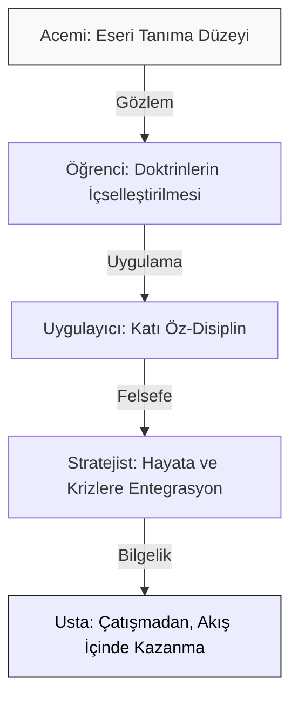

# Sun-Tzu Mastery: Kişisel Gelişim ve Stratejik Bilgelik 🏮

**"En büyük zafer, kişinin kendi üzerindeki zaferidir."**

---

## 🏛 Vizyon: Karakter, Disiplin ve Bilgelik

**Sun-Tzu Mastery**, Sun Tzu'un kadim eseri *Savaş Sanatı*'nı biyolojik ve sosyal bir varlık olarak insanın kendi varoluşsal mücadelesi için bir **Kişisel Gelişim İşletim Sistemi** olarak ele alır. Bu depo, stratejiyi bir "başkalarını yenme" aracı olarak değil, bir **"kendine hakim olma"** (Self-Sovereignty) disiplini olarak analiz eder.

> *"Yüz savaşta yüz zafer kazanmak en yüksek yetkinlik değildir. Asıl yetkinlik, düşmanın ordusunu hiç savaşmadan boyun eğdirmektir."* — Sun Tzu

Bu temel felsefe, hayatımızdaki "düşmanları" (kötü alışkanlıklar, tükenmişlik hissi, öfke, erteleme hastalığı, zehirli ilişkiler) savaşmadan ve kendimizi tüketmeden nasıl alt edeceğimizi öğretir. Düşmanla kılıç kılıça çarpışmak enerjiyi bitirir; onun yerine düşmanın hareket alanını daraltmak, kaynaklarını kesmek (kötü alışkanlıkları tetikleyen unsurları ortadan kaldırmak) gerekir.

---

## 📖 Başucu Alıntıları ve Felsefi Şerhler

Sun Tzu'nun bilgeliği sadece generallere değil, zihninin patronu olmak isteyen herkese hitap eder. İşte temel öğretilerin derin analizleri:

### 1. Öz-Farkındalığın Gücü
> *"Kendini ve düşmanını tanıyorsan, yüz savaşa girsen bile tehlikeye düşmezsin. Kendini bilip düşmanını bilmiyorsan, kazandığın her zafere karşılık bir de yenilgi alırsın. Ne kendini ne de düşmanını bilmiyorsan, girdiğin her savaşta yenilirsin."*

**Açıklama:** Kendi zayıf noktalarını (korkularını, tembelliklerini, bağımlılıklarını) dürüstçe analiz etmek en büyük erdemdir. "Düşman" burada dış dünyadaki rakiplerin yanı sıra senin en karanlık dürtülerindir. Kendini aynada tüm çıplaklığıyla görebilen, dışarıdan gelen hiçbir darbeyle sarsılmaz.

### 2. Savunma ve Saldırı Dengesi (Karakter Kalesi)
> *"Yenilmezlik savunmada yatar; zafere ulaşma olasılığı ise saldırıdadır. Savunma, gücün yetersiz olduğu; saldırı ise gücün fazlasıyla yeterli olduğu zaman yapılır."*

**Açıklama:** Hayatta büyük başarılara (saldırı) koşmadan önce, içsel disiplinini, mental sağlığını ve rutinlerini (savunma) sağlama alman gerekir. Eğer uyku düzenin kötüyse, paranı yönetemiyorsan, duygusal fırtınalarda kayboluyorsan "saldırı" moduna geçmek felaket getirir. Önce yıkılması imkansız bir **Karakter Kalesi** inşa et.

### 3. Zihinsel Matris: Rüzgar, Orman, Ateş ve Dağ
> *"Hareket ederken rüzgar gibi hızlı ol. Plan yaparken orman gibi sıkı ol. Vururken ateş gibi yakıcı ol. Beklerken dağ gibi sarsılmaz ol."*

**Açıklama:** Duygusal tepkisizlik ve gerektiğinde atik olma sanatıdır. Provokasyonlara karşı bir "Dağ" gibi tepkisiz kal; fırsat doğduğunda "Rüzgar" gibi süratli hareket et; yeni bir bilgi öğrenirken veya çalışırken "Orman" gibi derin ol; kötü bir alışkanlığı kesip atarken "Ateş" gibi kesin ve acımasız ol.

### 4. Yanılsama ve Gizlilik Sanatı (Kendi Zihnini Hacklemek)
> *"Bütün savaş sanatı aldatmacaya dayanır. Bu yüzden yetenekli olduğumuzda yeteneksiz görünmeliyiz; aktif olduğumuzda pasif görünmeliyiz."*

**Açıklama:** Başkalarına hava atmayı, sahip olduğun potansiyeli sosyal medyada bağırmayı bırak. Başarının gürültülü olmasına izin verme, enerjini şova değil icraata sakla. Sessizlik içinde çalış ("pasif görün"), ancak arka planda acımasız bir disiplinle hedeflerine doğru ilerle ("aktif ol").

### 5. Boşluk ve Doluluk İlkesi (Tükenmişlikten Arınma)
> *"Savaşta şekil, suyu andırmalıdır. Su nasıl yüksekten kaçıp alçağa doğru akıyorsa, savaş da güçlüyü bırakıp zayıfa saldırmaktır."*

**Açıklama:** İnsanın iradesi sınırlıdır. Her cephede ("doluluk" olan yerlerde, örneğin; sana direnç gösteren işlerde veya düzelmeyecek toksik ilişkilerde) inatla savaşmak seni tüketir. "Boş alanları" (akışta ilerleyebildiğin, doğal yeteneklerinin olduğu alanları) bul ve tüm gücünü o yöne akıt. Direnci kafa atarak kırmak yerine, tıpkı su gibi engelin etrafından dolaş.

---

## 🚀 Stratejik Yaşam Metodolojisi (SYMet)

Doktrinleri hayatınıza entegre etmek için şu 5 aşamalı metodolojiyi izleyin:

1.  **İçsel Tahribatı Durdur (Doktrin II):** Enerjini tüketen gereksiz tartışmaları, kötü alışkanlıkları ve negatif düşünceleri "maliyet analizi" ile terk et.
2.  **Yenilmez Karakter İnşa Et (Doktrin IV):** Dış dünyaya saldırmadan önce, kendi etik ve disiplin duvarlarını ör. Günlük rutinlerini çelik gibi sağlamlaştır.
3.  **Tevazu ve Esneklik Kazan (Doktrin VII):** Egonun sertliğini kır. Akıcı bir su gibi ol: önüne çıkan kayayla savaşmak yerine etrafından dolan.
4.  **Boşlukları Tespit Et (Doktrin VI):** > *"Rakibin güçlü olduğu yerlerden kaçın, zayıf olduğu yerlere yüzünü dön."* Kendi zayıf yönlerini dürüstçe fark et ve enerjini sadece dönüştürebileceğin boşluklara yönelt. Yeteneksiz olduğun alanda inat etmek kibrin eseridir.
5.  **Bütünlük İçinde Kazan (Doktrin III):** Sorunları kimseyi ve hiçbir şeyi yıkmadan, durumu entelektüel zarafetle çöz. Yıkım bırakan kazanımlar aslında mağlubiyettir.

---

## 🗺️ Ustalık Yol Haritası (Mastery Roadmap)

Stratejik bilgelik seviyenizi şu adımlarla yükseltin:

---

## 📜 On Üç Doktrin: Bireysel Gelişim Arşivi

| # | Doktrin | Kişisel Gelişim Karşılığı | Temel Kazanım |
| :--- | :--- | :--- | :--- |
| **01** | [Planlama (Laying Plans)](doctrines/01_planning) | **Öz-Farkındalık** | Kendini, potansiyelini ve sınırlarını acımasızca, dürüstçe tartma. |
| **02** | [Operasyon (Waging War)](doctrines/02_operations) | **Enerji Yönetimi** | İradeyi ve zihinsel sermayeyi tasarruflu, ölçülü kullanma. |
| **03** | [Saldırı (Attack by Stratagem)](doctrines/03_strategic_attack) | **Çatışma Çözümü** | Karşındakine zarar vermeden, aklınla sorunu bertaraf etme. |
| **04** | [Düzen (Tactical Dispositions)](doctrines/04_tactical_dispositions) | **Öz-Disiplin** | Zaafiyetleri kapatıp, sarsılmaz bir içsel kale kurma. |
| **05** | [Enerji (Energy)](doctrines/05_energy) | **Motivasyon & Potansiyel** | Birikmiş gücü doğru anda, maksimum etkiyle serbest bırakma. |
| **06** | [Zayıf/Güçlü (Weak Points and Strong)](doctrines/06_weak_points_and_strong) | **Önceliklendirme (Focus)** | Dikkati sadece hayati etki yaratacak eksik noktalara yöneltme. |
| **07** | [Manevra (Maneuvering)](doctrines/07_maneuvering) | **Zihinsel Çeviklik** | Değişen şatlara veya krizlere karşı "Su" gibi uyum sağlama. |
| **08** | [Varyasyon (Variation in Tactics)](doctrines/08_variation_in_tactics) | **Duygusal Denge** | Öfke, kibir, korku gibi beş temel zayıflıktan arınma. |
| **09** | [Yürüyüş (The Army on the March)](doctrines/09_the_army_on_the_march) | **Gözlem ve Sezgi** | Çevredeki sinsi tehlikeleri ve örtülü fırsatları okuma sanatı. |
| **10** | [Arazi (Terrain)](doctrines/10_terrain) | **Sosyal Sınırlar** | Yanlış insanlardan uzak durma, doğru ve besleyici ortamı seçme. |
| **11** | [Durumlar (The Nine Situations)](doctrines/11_the_nine_situations) | **Kriz Psikolojisi** | Ölüm arazisi (Death Ground) veya çıkmaz durumlarda paniklememe. |
| **12** | [Ateş (The Attack by Fire)](doctrines/12_the_attack_by_fire) | **Radikal Arınma** | Toksik bağları acımasızca kesme, eski benliğini küle çevirip yeniden doğma. |
| **13** | [Casuslar (The Use of Spies)](doctrines/13_the_use_of_spies) | **Öngörü ve Bilgi** | Başkalarının deneyimini, dedikodu yerine somut bilgi (insight) olarak kullanma. |

---

## 🏮 Karakter Heuristikleri (Sezgisel İlkeler)

Günlük modern yaşamda karar alırken savaş sanatının bu altın kuralları her zaman cebinizde olsun:

- **Egonun Ölümü:** Kibiri hemen şu an terk et. Doktrin VI'da belirtildiği gibi ego seni körleştiren bir "doluluktur" (Fullness). Yeni bir şey öğrenmek ve gelişmek için "boş olmalısın" (Emptying). Bardağını boşalt ki içine taze su dolsun.
- **Duygularının Efendisi Ol:** Öfkeyle, hırsla veya kıskançlıkla atılan adımlar doktrinlerdeki en ölümcül yönetici hatalarıdır. Öfke zamanla geçer ancak yıkılan itibar ve harcanan fırsatlar geri gelmez. Dağ gibi sessiz ol.
- **Sükunet En Büyük Güçtür:** Sessizlik, çok şey bilenlerin en güçlü silahıdır. Cehalet daima gürültücüdür. Hazırlık aşamasında planlarını kimseye anlatma.
- **Hareketsizlik Harekettir:** Doktrinlerde belirtildiği üzere, en iyi generali hata yapmayan generaldir. Bazen hiçbir şey yapmamak, sakin bir şekilde fırtınanın dinmesini beklemek en üstün manevradır. Zaman kazanmak aklı kazanmaktır.

---

## ⚠️ Karakterin Beş Zayıf Yönü (The Five Dangerous Faults)

Sun Tzu, bir liderin (zihninin patronu olan kişinin) çöküşüne neden olacak 5 ölümcül karakter kusurunu açıklar. Modern dünyada ve içsel şavaşlarımızda bu zaaflar şunlardır:

1.  **Pervasızlık (Recklessness):** Sadece cesaret gösterisine dönüşen, hesapsız ve düşüncesizce alınan büyük riskler. Aptalca bir adrenalin tutkusudur. Sonucu *yıkım*dır.
2.  **Korkaklık (Cowardice):** Başarısızlık korkusu yüzünden sürekli "daha fazla öğrenmeliyim" yalanına sığınıp eyleme geçememek, güvenli konfor alanında kalmak. Sonucu iradenin *esaret*idir.
3.  **Öfke (Hasty Temper):** En ufak bir provokasyonda veya geri bildirimde parlamak, duygusal tepkilerini kontrol edememek. Dümeni korteksten alıp amigdalaya devretmektir. Sonucu manipülatörler tarafından rahatça *tuzağa düşürülebilmektir*.
4.  **Aşırı Onur Düşkünlüğü (A Delicacy of Honor):** Başkalarının ne düşündüğünü çok umursamak, "elalem ne der" veya "prestijim zedelenir mi" korkusuyla hareket etmek. Başarıyı gösterişe kurban etmektir. Sonucu en ufak bir utanç tehdidiyle *dışarıdan yönetilebilir olmaktır*.
5.  **Aşırı Merhamet ve Bağımlılık (Over-Solicitude):** Seni aşağı çeken insanlara, işe yaramayan rutinlere veya toksik çevrelere sırf tanıdık geliyor diye veya yersiz bir vefa duygusuyla tutunmak. Sonucu potansiyelini başkalarının zayıflıkları uğruna *heba etmektir*.

---

## 👁️ Bilgi Diyeti ve Kendi Zihninin Casusu Olmak (Casuslar Doktrini)

> *"Öngörü, ne ruhlardan ne tanrılardan ne de geçmiş olayların kıyaslanmasından elde edilir. Sadece durumu gerçekten bilen insanlardan (casuslardan) alınır."*

Dijital çağda hisarlarınızın en zayıf noktası "Bilgi Tüketimi Duvarı"dır. Zihninize giren her haberi, her sosyal medya önerisini sisteminize sızan bir "Casus" olarak düşünün. İçeriye sızan yanlış casuslar (Doomscrolling, felaket senaryoları, ucuz dopamin) beyninizi aslında var olmayan krizler için strese sokar, enerjinizi hiçliğe harcatır. Sun Tzu stratejisinde bilgi, saf bir güçtür; kirlilik değil.

- **Kendi Zihninin Casusu Ol:** Kendi davranışlarını üçüncü evrenden, duygusuz bir ajan gibi uzaktan izle. "Şu an neden bu ucuz hazzı kovalıyorum? Çalışmaktan neden kaçıyorum?" İçerideki ajanın (saf ve yalın dürüstlüğün) sana gerçekleri raporlamasına izin ver. Kendi yalanlarına inanma.
- **Enformasyon Güvenliğini Sağla:** Müttefiklerinden (okuduğun felsefe kitapları, doğru hedefler) gelen bilgileri koru, düşman unsurların (dikkat dağıtıcı algoritmalar) sistemine girmesini engelle.

---

## 🛑 Eylemsizlik Sanatı ve FOMO (Girilmemesi Gereken Savaşlar)

> *"Gidilmemesi gereken yollar vardır; saldırılmaması gereken ordular vardır; kuşatılmaması gereken şehirler vardır; uğrunda savaşılmaması gereken mevziler vardır."*

Modern dünyanın psikolojik vebası **FOMO**'dur (Fear of Missing Out - Fırsatları Kaçırma Korkusu). Sürekli bir şeyleri yakalama telaşı, en sonunda her şeyi yarım bırakmakla ve derinlikten yoksun sığ bir hayatla sonuçlanır. Sun Tzu bu konuda çok nettir: Her fırsat, asıl hedefine giden bir köprü değildir; birçoğu sadece senin enerjini ve zamanını sömürmeyi amaçlayan birer **tuzaktır**.

- **Hayır Deme Disiplini:** Enerjini dağıtan, senin "Yetkinlik Çemberinin" dışında kalan parlak projelere, anlık heveslere ve hedefinle uyuşmayan sosyal davetlere acımasızca **"HAYIR"** de. Sınır çekmek, kendi krallığını korumaktır.
- **Beklemenin Gücü:** Harekete geçmek her zaman doğru strateji değildir. Bazen en üstün manevra, rakiplerinin ve çevrendeki disiplinsiz yığınların hata yapmasını, kendi kendilerini tüketmelerini bir dağ gibi sessizce izlemektir.

---

## 🏹 Momentum ve İrade Tetikleyicisi (Shih - Enerji Doktrini)

> *"İyi savaşçıların yarattığı enerji, gerilmiş bir tatar yayı gibidir; kararları ise tetiğin çekilmesi gibidir."*

Disiplin, her an savaşıyormuş gibi kendinizi psikolojik olarak zorlamak, dişlerinizi sıkarak acı çekmek değildir. Disiplin, **sürtünmeyi azaltmaktır** (oku yaya yerleştirmek) ve sadece **doğru anda tüm kuvvetiyle harekete geçmektir** (tetiği çekmek).

- **Sistem vs. Motivasyon:** Motivasyon anlık bir hevestir, saman alevidir; ama sistemi olmayan bir insanın alevi çabuk söner. Ortamınızı öyle bir hazırlayın ki, doğru olanı yapmak (çalışmak, odaklanmak) en akıcı seçenek olsun. Tetiği çekmek anlık bir irade işidir; ancak o yayı önceden germek sistemin (alışkanlıkların) ta kendisidir. Doğru rutinlere sahip olduğunuzda kararlar otomatikleşir, enerji boşa harcanmaz.

---

## 👑 Otorite ve Birey: Hükümdar ve General (Bağımsızlık Doktrini)

> *"Savaşı kazanacağını bilen ve hükümdarı tarafından müdahale edilmeyen general zafer kazanır."*

Sun Tzu'ya göre Hükümdar (Sovereign/Kral) politikayı belirler, ancak savaş alanındaki taktiklere karışması felaket getirir. Sahadaki gerçeği sadece general (siz) bilirsiniz. Bunu modern bireyin yaşamına uyarladığımızda Hükümdar; toplumun beklentileri, ailenin dayatmaları, mahalle baskısı veya "uzman" denilen dış otoritelerdir. General ise sizin kendi rasyonel zihniniz ve bağımsız iradenizdir.

- **Sahadaki Gerçeklik:** Kendi hayatınızın savaşını (kariyer, eğitim, kişisel gelişim) verirken, uzaktan konuşan ve savaş alanının (sizin iç dünyanızın) dinamiklerini bilmeyen "hükümdarların" (toplum/çevre) sizi mikro-yönetmesine izin vermeyin.
- **İtaatsizlik Cesareti:** Gerektiğinde dış dünyanın "güvenli" veya "doğru" kabul ettiği rotayı reddetme cesaretini gösterin. Eğer general sahada tehlikeli bir hata görüyorsa, uzaktaki kralın aptalca emrine itaatsizlik etmekle yükümlüdür. Kendi varoluşsal vizyonunuza (Tao'nuza) ihanet etmeyin.

---

## 🧠 Zihinsel Modeller ve Sun Tzu Entegrasyonu

Sun Tzu'nun 2500 yıllık düşünce yapısı, bilmeden modern girişimcilerin ve filozofların kullandığı zihinsel modellere ilham vermiştir:
1.  **Inversion (Tersine Çevirme):** Nasıl "Başarılı" olayım sorusunu bırak, "Nasıl Kesinlikle Başarısız Olurum?" sorusunu sor. Kaybetmeye giden yolları (tembellik, uykusuzluk, eğitimsizlik) tıkadığında, zafer kaçınılmaz doğal sonuç olarak ortaya çıkar.
2.  **First Principles (Temel İlkeler):** Karmaşık bir kaosta kaybolduğunda, temel gerçeğe; "Tao"ya dön. Neden buradasın? Amacın ne? Dış etkenler dursa da ilkelerin sabittir.
3.  **Circle of Competence (Yetkinlik Çemberi):** Doktrin X (Arazi). Sadece özelliklerini çok iyi bildiğin "arazilerde" savaş. Anlamadığın kripto paraya yatırım yapma, bilmediğin konularda tartışmaya girme. Çemberinin içinde kal.

---

## ⚔️ Gündelik Yaşam Savaşları (Modern Senaryolar)

Klasik askeri stratejileri modern insanın günlük kaosuna uyarlamak için şu 3 temel senaryoyu referans alın:

*   **Senaryo 1: Toksik Bir Tartışmanın Eşiği**
    *   *Sun Tzu Diyor ki:* "Savaşlardan kaçınan komutan, ülkesini koruyan komutandır."
    *   *Uygulama:* İnternette veya sosyal çevrende seni provoke eden bir yoruma cevap verecek misin? Dur. Bu "savaşı" kazanmanın sana stratejik / zihinsel bir getirisi var mı? Hayır. Egonu tatmin etmek için enerjini bu bataklığa gömme. Sessiz kalarak, rakibine karşılık vermeyerek tartışmayı kökünden kurut (Doktrin III: Savaşmadan Kazanma).
*   **Senaryo 2: Erteleme Hastalığı (Procrastination) ile Yüzleşme**
    *   *Sun Tzu Diyor ki:* "Hız, savaşın özüdür; düşmanın hazırlıksız oluşundan faydalanın."
    *   *Uygulama:* Tembellik senin iç düşmanındır. Tüm gün motive olmayı (Gök/İklim in mükemmel olmasını) beklersen asla harekete geçemezsin. İçindeki tembellik mekanizması savunmasını tam kurmadan önce, beynini aldatarak "Sadece 5 dakika yapacağım" diyerek ani ve hızlı bir başlangıç taarruzu gerçekleştir (Doktrin V: Enerji).
*   **Senaryo 3: Konfor Alanı ve Gelişim Eksikliği**
    *   *Sun Tzu Diyor ki:* "Askerlerini derin ölüm vadisine sür, onlar orada hayatta kalmak için dövüşsünler." (Ölüm Arazisi - Death Ground)
    *   *Uygulama:* Rahatlık alanındayken insanoğlu nadiren maksimum potansiyeline ulaşır. Eğer köklü bir değişim yapmak istiyorsan, geri dönüş yollarını (tembelliğe izin veren kaçış rotalarını, gereksiz abonelikleri vb.) kes. Radikal adımlar atmak zorunda olduğun bir duruma zihnini sok. Beyin hayatta kalmak (başarmak) için limitlerinin çok ötesinde çalışacaktır (Doktrin XI: Durumlar).

---

## 📂 Depo Yapısı

- **[core/](core/):** Felsefi derinlik, Karakter İnşası, Stoacılık ve Taoizm üzerine manifestolar.
- **[doctrines/](doctrines/):** 13 ana doktrinin modern bireysel gelişim arenasına uyarlanmış analizleri. Her doktrin kendi içinde bir aydınlanma sürecidir.
- **[docs/](docs/):** Öğretici notlar, akıl haritaları, referans grafikler ve genişletilmiş alıntılar.
- **[strategic_os/](strategic_os/):** (Yan Dizin) Stratejinin teknik ve mühendislik sistemlerine uyarlandığı, profesyonel terminal araçları.

---

## 🕊️ Katkı ve Kolektif Bilgelik

Bu depo, bilgiçlik taslamak için değil, "Öğrenmek ve Yanlışlardan Arınmak" için yaşayan bir organizmadır. Bir doktrini hayatınızda nasıl somut bir disipline dönüştürdüğünüzü, hangi psikolojik savaşınızı kazandığınızı veya esere dair yeni bir felsefi şerhinizi paylaşmak isterseniz; [CONTRIBUTING.md](CONTRIBUTING.md) protokolünü izleyerek bilgeliğinizi ekleyin.

---

  Meta-Engineering Research Lab tarafından 🏮 ile inşa edilmiştir.
   
  "Zayıf görün ama güçlü ol; görünmez ol ama her yerde ol. Zihin su gibi berrak ve akışkan olsun."

