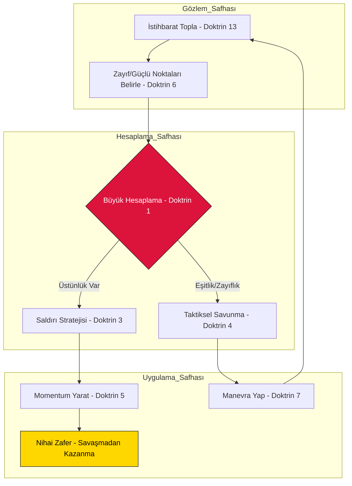

# Sun-Tzu Mastery: Stratejik İşletim Sistemi (S.O.S) 🐉


<div align="center">

[](https://github.com/arch-yunus/Sun-Tzu-Mastery)
[](core/README.md)
[](core/README.md)
[](LICENSE)

**"Savaşı kazanan general, savaştan önce karargahında binlerce hesaplama yapandır. Hesaplaması çok olan kazanır, az olan kaybeder."**

</div>

---

## 🏛 Stratejik Vizyon: "Sovereign" Mühendislik

**Sun-Tzu Mastery (S.O.S)**, basit bir bilgi bankası değildir; bir organizasyonun zekasını, hızını ve dayanıklılığını optimize eden bir **Meta-İşletim Sistemi**'dir. Modern sistemlerin karmaşıklığı (Chaos), belirsizliği (Entropy) ve rekabeti (Game Theory) karşısında; Sun Tzu'nun 2500 yıllık doktrinlerini birer **Algoritmik Karar Destek Mekanizması**'na dönüştürüyoruz.

Bu sistem, organizasyonunuzu sadece "dayanıklı" (Resilient) değil, **Antifragile** (Kaostan beslenen) hale getirmeyi hedefler.

---

## 🚀 Stratejik Olgunluk Modeli (Strategic Maturity Model - SMM)

Projelerinizin ve ekiplerinizin stratejik seviyesini belirleyin:

| Seviye | Durum | Tanım | Doktrin Odağı |
| :--- | :--- | :--- | :--- |
| **Lvl 1** | **Reaktif** | Sadece kriz anında tepki verir. Planlama yoktur. | Doktrin XI (Kriz) |
| **Lvl 2** | **Operasyonel** | Kaynakları yönetebilir ancak vizyon eksiktir. | Doktrin II (Maliyet) |
| **Lvl 3** | **Taktiksel** | Savunma hatları kuruludur, sistem stabildir. | Doktrin IV (Düzen) |
| **Lvl 4** | **Stratejik** | İvme (Shi) kazanılmış, pazar boşlukları izlenir. | Doktrin V (Enerji) |
| **Lvl 5** | **Sovereign** | Rekabeti savaşmadan bitirir, pazarı domine eder. | Doktrin III (Saldırı) |

---

## 📊 Karar Motoru: Sun-Tzu Karar Döngüsü (STDE)

Aşağıdaki diyagram, kriz veya fırsat anlarında sistemin nasıl bir geri bildirim döngüsü (Cybernetic Loop) ile çalıştığını gösterir:



---

## 📜 On Üç Doktrin: Mühendislik Masterclass Serisi

| # | Doktrin | Modern Teknik Paradigma | Antifragility Karşılığı |
| :--- | :--- | :--- | :--- |
| **01** | [Planlama](doctrines/01_planning) | **System Specs & Design Docs** | *Optionality:* Planın esnekliği riski azaltır. |
| **02** | [Operasyon](doctrines/02_operations) | **FinOps & Resource Allocation** | *Skin in the Game:* Kaynak maliyeti sorumluluk getirir. |
| **03** | [Saldırı](doctrines/03_strategic_attack) | **Market Disruption & Mergers** | *Barbell Strategy:* Düşük riskli temel, yüksek riskli inovasyon. |
| **04** | [Düzen](doctrines/04_tactical_dispositions) | **SRE & Hardened Infrastructure** | *Via Negativa:* Gereksiz kodun temizlenmesi güvenliği artırır. |
| **05** | [Enerji](doctrines/05_energy) | **High-Frequency Deployment (CI/CD)** | *Convexity:* Küçük hatalardan büyük öğrenimler devşir. |
| **06** | [Zayıf/Güçlü](doctrines/06_weak_points_and_strong) | **Feature Gaps & MVP Strategy** | *The Lindy Effect:* Kalıcı olanın üzerine inşa et. |
| **07** | [Manevra](doctrines/07_maneuvering) | **Pivot & Continuous Delivery** | *Ergodicity:* Sistemin hayatta kalma kabiliyeti. |
| **08** | [Varyasyon](doctrines/08_variation_in_tactics) | **Extreme Programming & Edge Cases** | *Robustness:* Değişen şartlara uyum. |
| **09** | [Yürüyüş](doctrines/09_the_army_on_the_march) | **Observability & Real-time Metrics** | *Feedback Loops:* Hızlı veri, hızlı eylem. |
| **10** | [Arazi](doctrines/10_terrain) | **Cloud Topology & Scalability** | *Scalability:* Sınırların ötesine büyüme. |
| **11** | [Durumlar](doctrines/11_the_nine_situations) | **Incident Response & Post-Mortems** | *Post-Traumatic Growth:* Krizden güçlenerek çıkma. |
| **12** | [Ateş](doctrines/12_the_attack_by_fire) | **Chaos Engineering** | *Stress Testing:* Sistemin sınırlarını zorlama. |
| **13** | [Casuslar](doctrines/13_the_use_of_spies) | **OSINT & Competitive Intelligence** | *Information Asymmetry:* Bilgi güçtür. |

---

## 🛠 Stratejik Araç Seti (Sovereign Tools)

S.O.S, sadece dosyalardan ibaret değildir; terminalinizde yaşayan bir strateji merkezidir.

### 🐍 Stratejik Python Motorları
- **[StrategicCalculation.py](frameworks/StrategicCalculation.py):** Sistemin Tao'sunu, Liderliğini ve Lojistiğini matematiksel olarak tartın.
- **[ResourceOptimization.py](frameworks/ResourceOptimization.py):** Teknik borç (Technical Debt) ile geliştirme hızı (Velocity) arasındaki oranı optimize edin.

```powershell
# Master Modunda Stratejik Hesaplama Başlat
python frameworks/StrategicCalculation.py --tao 10 --commander 10 --heaven_earth 9 --discipline 10 --logistics 10 --training 10
```

---

## 📂 Entegre Yapı ve Mimari

```text
.
├── .github/                # Stratejik Yönetişim (ISSUE/PR/CI-CD)
├── core/                   # Yazımsal Sütunlar (Sibernetik, Oyun Teorisi, Antifragility)
├── doctrines/              # 13 On-Chain Stratejik Doktrin
├── docs/                   # Görsel Varlıklar ve Mimari Şemalar
├── frameworks/             # Playbook'lar (SRE, Growth) ve Hesaplama Motorları
├── CONTRIBUTING.md         # Katılım Protokolü (Elite Katkıcılar İçin)
└── README.md               # S.O.S Ana Kontrol Paneli
```

---

## 🛰 Gelecek Projeksiyonu: Autonomous Strategist

Sistem, gelecekte bir **Otonom Stratejist** (`StrategicAI`) haline gelmeyi hedeflemektedir:
- **Faz 4:** Pazar verilerini (Coinbase, GitHub, AWS Health) dinleyen ve otomatik Doktrin öneren botlar.
- **Faz 5:** Stratejik simülasyonların Unreal Engine / Unity ortamında görselleştirilmesi.

---

<div align="center">
  <sub><strong>Meta-Engineering Research Lab</strong> tarafından inşa edilmiştir.</sub>
  <br>
  
  <br>
  <sub><em>"Savaş kazanmak bir meziyet değildir. Asıl meziyet, savaşacak düşman bırakmamaktır."</em></sub>
</div>