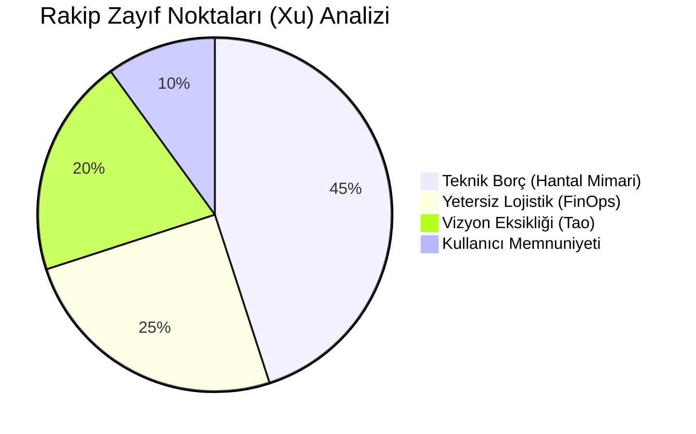
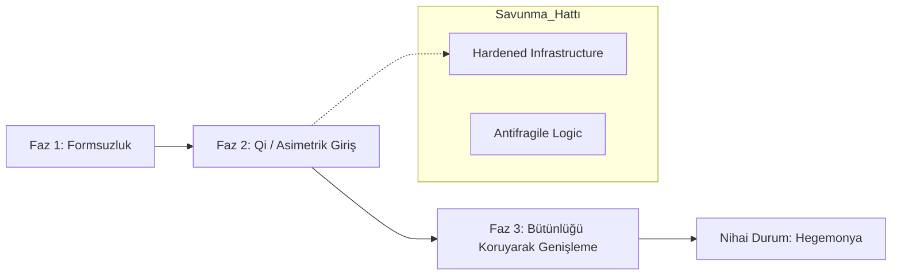

# Stratejik İstihbarat Raporu: Operasyon "Sovereign" ⛩️

> **Tarih:** 08-04-2026
> **Sınıflandırma:** Üst Düzey Stratejik (Top Secret)
> **Doktrin Odak:** Doktrin XIII & Doktrin VI

## 1. Rakip Durum Analizi (Market Gaps)

Aşağıdaki diyagram, mevcut pazar liderlerinin (Incumbents) güçlü ve zayıf (Xu/Shi) noktalarını analiz eder:

## 2. Stratejik Harekat Haritası (Strategic Maneuvers)

Mevcut projemizin (Sovereign) pazara giriş ve hakimiyet planı:

## 3. Kritik Sezgiseller (Golden Rules)
1.  **Düşmanı Meşgul Et:** Rakibin kendi teknik borçlarıyla ilgilenmesini sağla (Doktrin VI).
2.  **Sürprize Hazırlan:** Qi (dolaylı) özelliklerini en son ana kadar sakla (Doktrin V).
3.  **Lojistik Üstünlük:** Bulut maliyetlerini optimize etmeden büyük ölçekli saldırı başlatma (Doktrin II).

---
*Bu rapor, Sun-Tzu Mastery ekosistemi kullanılarak üretilmiştir.*
